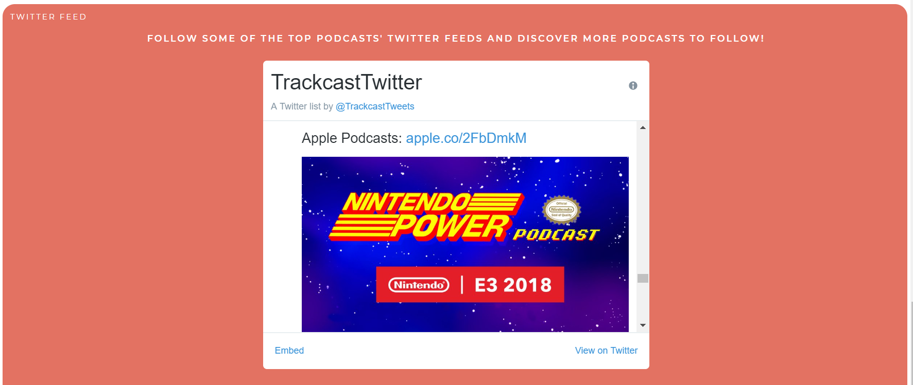

# TrackCast
[https://trackcast.herokuapp.com/](https://trackcast.herokuapp.com/)

Submission for Capital One's Software Engineering Summit

Requirement: Create a podcast search engine using gPodder's API
[https://www.mindsumo.com/contests/podcast-engine](https://www.mindsumo.com/contests/podcast-engine)

Browse, search, and view all your podcasts in a convenient and appealing format! Log-in to your gPodder account to view subscriptions, or browse through hundreds of other podcasts and toplists.

---

#### Technology:
**Front End:** HTML5, Javascript, css

**Back End:** Flask, Python3

**Data:** Jupyter Notebook

**APIs:** gPodder, Twitter

---

#### TLDR
TrackCast offers a display of your gPodder podcast subscriptions, browse, and search, as well as a "top list" section with the most subscribed podcasts. Select each podcast for a description and link to websites. 

The listen first section orders top 25 podcasts into most frequent publishing to least. Twitter feed offers multiple sources of podcast information from Apple Podcast and specific podcast accounts.

#### Analyzing Data From gPodder
The gPodder API was used to obtain user's subscriptions, in addition to searches and tags. Top tags(used as browse categories) were found by parsing gPodder tag data and sorting by most used.

Episode frequency was determined by parsing through the top 25 podcast's feed XMLs for pubDates, and finding the average of these dates over time to determine approximately how often episodes are posted. While I planned to simply use the 2 most recently episode publishing dates, I realized that special exceptions such as an impromptu extra episode were skewing the data. Thus, I used many episode dates from each podcast, then analyzed the average number of days between dates for all episodes. These podcasts were then sorted by most frequent to least, allowing the user to prioritize the more frequently occuring podcasts, to prevent falling behind.

In addition to a podcast description, all podcasts also provide a link to their specific websites, so episodes are a click away. Links to gPodder.net are also provided so users can subscribe if they are interested.

#### Front End Design
TrackCast offers a clean and appealing design to all users, with a nav bar to provide quick navigation.

View subscriptions by entering your username and password in the log-in form.  
The example above is for the following account info:  
username = user_1  
password = test

To avoid a text-heavy and clunky interface, TrackCast offers modal pop-ups that contain descriptions and links for every podcast. This is especially helpful for mobile versions, which would be quite clunky if excessive descriptions were automatically displayed.

TrackCast is also responsive to mobile users, thanks to flex-wrap css syling.

A clean logo and icon complements the application's simple design.

#### Addition
Now for the fun stuff.

At the beginning of this challenge, I knew about very few podcasts, so to inform the oblivious(like myself) and interest the seasoned podcast veterans, I decided to embed a twitter feed with some of the most popular podcast twitter accounts(This American Life, TWiT, RadioLab, and Apple Podcast). This provides users with a live-time feed to the newest and most interesting podcasts, which is helpful given gPodder's somewhat outdated resources.

For example:
Through TrackCast's twitter feed, I noticed a post Apple Podcast made during the E32018 video game conference. That post just happened to be on a podcast by Nintendo - the geniuses that developed Mario Kart and Super Smash Bros. I used TrackCast's search function to find Nintendo Power Podcast, and used the link provided to subscribe and listen about Zelda and Super Smash Bros to my heart's content. 

